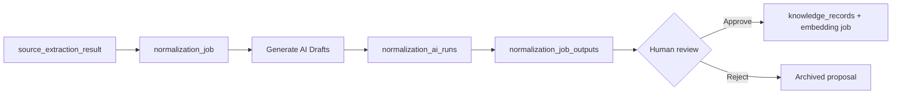

# AI-assisted draft normalization (Phase 2 Slice 4)

Uses AI **only** to propose `normalization_job_outputs` from extracted source text. AI never creates `knowledge_records` or publishes knowledge.

## Principles

- **Untrusted drafts** — every AI output is `is_ai_proposal: true` and `pending_review`.
- **Human gate** — approve/reject flows from Slice 2 unchanged; only approval publishes.
- **Source grounding** — each proposal includes `source_quote_refs`; missing or unverified quotes lower `confidence_score`.
- **Database-driven prompts** — six `prompt_templates` rows linked to `normalization_templates`; no TypeScript enums.
- **Graceful degradation** — if `OPENAI_API_KEY` is unset, the UI shows a clear error (no crash).

## Flow



1. Fetch a trusted source and create a normalization job (Slice 2).
2. On `/normalization/[id]`, click **Generate AI Drafts**.
3. Server loads linked `prompt_templates` row, calls OpenAI (`ai_provider_configs`), inserts one or more AI proposals.
4. Reviewer verifies quotes against extraction markdown, edits fields, then **Approve & publish** or **Reject**.

## Tables

| Table | Purpose |
|-------|---------|
| `ai_provider_configs` | Provider/model settings (e.g. OpenAI `gpt-4o-mini`) |
| `prompt_templates` | System/user prompts per normalization template |
| `normalization_ai_runs` | Audit trail per generation request |
| `normalization_job_outputs` (extended) | `extraction_notes`, `source_quote_refs`, `is_ai_proposal`, `normalization_ai_run_id` |

## Prompt templates (seed)

| Code | Label |
|------|-------|
| `concept_card_extractor` | Concept Card Extractor |
| `model_card_extractor` | Model Card Extractor |
| `node_card_extractor` | Node Card Extractor |
| `workflow_pattern_extractor` | Workflow Pattern Extractor |
| `failure_candidate_extractor` | Failure Candidate Extractor |
| `recipe_candidate_extractor` | Recipe Candidate Extractor |

## Environment

```bash
OPENAI_API_KEY=sk-...   # required for AI draft generation
```

## UI

- `/normalization/[id]` — manual draft (left), AI proposals (center), AI runs history (sidebar), extraction reference (bottom).

## Audit events

- `normalization_ai_run_start`
- `normalization_ai_run_complete`
- `normalization_ai_run_failed`

## Tests

```bash
npm run test:ai-normalization
```

## Out of scope

- Autonomous agents, auto-approval, recursive crawling, decision engine
- Publishing without human approval
