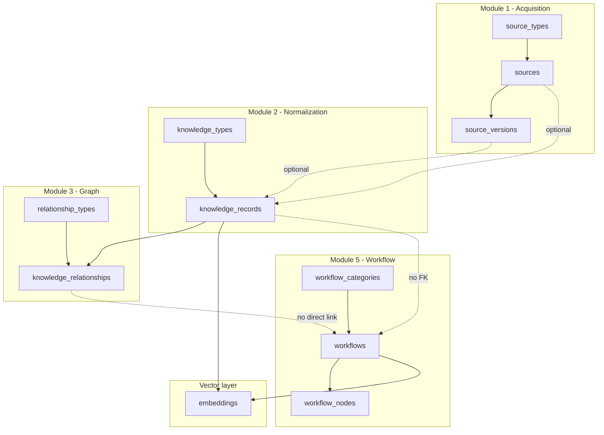
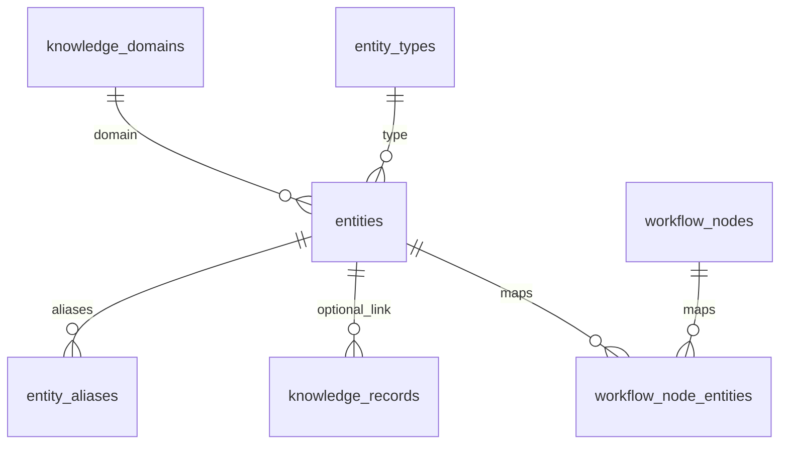
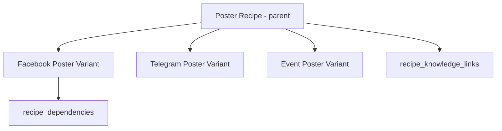
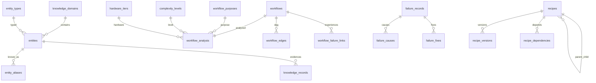

# CKOS Phase 1.5 — Architecture Audit & Expansion Design

**Role:** Principal Architect / Database Engineer / Systems Designer  
**Scope:** Audit existing Phase 1 foundation; design Phase 1.5+ expansions **without schema rewrites**  
**Status:** Audit + design only (no implementation in this deliverable)

---

## Executive verdict

| Capability | Supported today? | Without rewrite? | Path |
|------------|----------------|------------------|------|
| Workflow Intelligence (basic ingest) | Partial | Yes | Add `workflow_analysis`, graph metrics, canonical entity links |
| Workflow Intelligence (scoring engine) | No | Yes | Additive tables + app/DB functions |
| Failure Analysis (structured) | Partial (JSONB blobs) | Yes | Normalize into child tables; keep `failure_records` |
| Recipe Inheritance | No | Yes | Add versions, `parent_recipe_id`, dependencies |
| Decision Engine | No | Yes | Add goals/constraints/recommendation tables |
| Multi-domain expansion | Partial | Yes | Add `knowledge_domains`; FK on records/sources |
| AI-assisted normalization | Partial | Yes | Add `normalization_jobs` / provenance on records |
| Future agent systems | No | Yes | Add `agent_runs`, `tasks`, outbox pattern |

**Conclusion:** The Phase 1 schema is a valid **extensible spine**. Gaps are **missing modules**, not wrong primitives. All Phase 1.5 designs below are **additive migrations** (new tables, nullable FKs, backfill scripts). No destructive changes required.

---

# STEP 1 — Full architecture audit

## 1.1 Extensions

| Extension | Schema | Purpose |
|-----------|--------|---------|
| `vector` | `extensions` | pgvector embeddings (`extensions.vector(1536)`) |
| `pg_trgm` | (default) | Declared; **not yet used** in indexes |

---

## 1.2 Tables — complete inventory

### `status_types`

| Column | Type | Constraints |
|--------|------|-------------|
| id | UUID | PK, default `gen_random_uuid()` |
| domain | TEXT | NOT NULL |
| code | TEXT | NOT NULL |
| label | TEXT | NOT NULL |
| description | TEXT | |
| sort_order | INT | NOT NULL, default 0 |
| is_terminal | BOOLEAN | NOT NULL, default false |
| created_at, updated_at | TIMESTAMPTZ | NOT NULL |
| created_by | UUID | FK → `auth.users` ON DELETE SET NULL |
| version | INT | NOT NULL, default 1 |
| status | UUID | FK → `status_types(id)` self |

**Unique:** `(domain, code)`  
**Purpose:** Database-driven lifecycle states (entity draft/active/archived/deprecated).  
**Dependencies:** Referenced by nearly all entity tables.  
**Risks:** Self-referential `status` on bootstrap rows; no CHECK that `domain` is from a registry.  
**Improvements:** Add `lookup_domains` table or document allowed domains; index `(domain, code)` covered by UNIQUE.

---

### `organizations`

| Column | Type | Constraints |
|--------|------|-------------|
| id | UUID | PK |
| name | TEXT | NOT NULL |
| slug | TEXT | NOT NULL, UNIQUE |
| metadata | JSONB | default `{}` |
| + standard audit columns | | status → status_types |

**Purpose:** Multi-tenant hook (future RBAC).  
**Dependencies:** `profiles.default_organization_id`, nullable `organization_id` on content tables.  
**Risks:** RLS allows all authenticated users to SELECT all orgs; no membership table yet.  
**Improvements:** `organization_members` with roles; tighten RLS.

---

### `profiles`

| Column | Type | Constraints |
|--------|------|-------------|
| id | UUID | PK, FK → `auth.users` ON DELETE CASCADE |
| display_name, avatar_url | TEXT | |
| default_organization_id | UUID | FK → organizations |
| metadata | JSONB | |
| + audit columns | | |

**Purpose:** User profile extension.  
**Dependencies:** Auth trigger `handle_new_user`.  
**Risks:** No INSERT policy for users (trigger is SECURITY DEFINER — OK).

---

### `source_types`

Lookup: wiki, documentation, github, workflow_library, research_paper, youtube_transcript, community.

**Purpose:** Classify acquisition sources (DB-driven).  
**Improvements:** Add optional `knowledge_domain_id` when domains table exists.

---

### `sources` → `source_versions`

**FKs:**
- `sources.source_type_id` → `source_types`
- `sources.organization_id` → `organizations` (CASCADE)
- `source_versions.source_id` → `sources` (CASCADE)
- UNIQUE `(source_id, version_number)`

**Indexes:** None beyond PK/FK on sources (gap: no index on `source_type_id`, `organization_id`).

**Purpose:** Module 1 — acquisition + version history.  
**Risks:** `source_version_id` on knowledge_records can orphan if version deleted (SET NULL on source only, not version).  
**Improvements:** Index `(organization_id)`, `(source_type_id)`; optional `content_hash` uniqueness per source.

---

### `knowledge_types` → `knowledge_records`

**FKs:**
- `knowledge_records.knowledge_type_id` → `knowledge_types`
- `knowledge_records.source_id` → `sources` SET NULL
- `knowledge_records.source_version_id` → `source_versions` SET NULL
- `knowledge_records.organization_id` → organizations CASCADE

**Indexes:**
- GIN `knowledge_records_search_idx` on `search_vector` (generated)
- `knowledge_records_type_idx`, `knowledge_records_org_idx`

**Generated column:** `search_vector` from title, summary, `structured_data::text`

**Purpose:** Module 2 — normalized knowledge.  
**Risks:**
- **Overlaps future `entities`** — same conceptual layer, different grain.
- `structured_data` is schemaless JSONB; `schema_definition` on type is not enforced in DB.
- No FK from `knowledge_records` → `workflows` or canonical entities.

**Improvements:** Add nullable `entity_id` → `entities`; add `domain_id`; CHECK or trigger validating JSON against type schema.

---

### `relationship_types` → `knowledge_relationships`

**FKs:** from/to → `knowledge_records` CASCADE; `relationship_type_id` → `relationship_types`  
**CHECK:** `from_record_id <> to_record_id`  
**UNIQUE:** `(from_record_id, to_record_id, relationship_type_id)`

**Indexes:** `from_record_id`, `to_record_id`

**Purpose:** Module 3 — knowledge graph (record-to-record only).  
**Risks:**
- Graph is **knowledge-record-centric**, not canonical-entity-centric → duplicate concepts = duplicate nodes.
- No edges to workflows, failures, or recipes.
- `expand_knowledge_graph` recursive CTE can over-expand on dense graphs (no cycle detection).

**Improvements:** `entity_relationships` parallel table; `graph_edges` polymorphic `(from_type, from_id, to_type, to_id)` for unified graph.

---

### `workflow_categories` → `workflows` → `workflow_nodes`

**FKs:**
- `workflows.category_id` → `workflow_categories` SET NULL
- `workflow_nodes.workflow_id` → `workflows` CASCADE
- UNIQUE `(workflow_id, node_key)`

**Indexes:** GIN on `workflows.search_vector`

**Purpose:** Module 5 — workflow storage + node extraction.  
**Risks:**
- **No `workflow_analysis`** — complexity/purpose/hardware not persisted.
- **No edge table** — cannot compute graph depth/branching in SQL without parsing JSON.
- `workflow_categories` (txt2img, controlnet, …) ≠ **workflow purpose** (poster, character consistency, …) — conflated concerns.
- Parser supports API format + legacy node dict; does not extract model/controlnet/lora counts in DB.
- `workflow_nodes` not linked to canonical node entities.

**Improvements:** See Step 3 — `workflow_analysis`, `workflow_purposes`, `workflow_node_edges` (optional Phase 1.5b).

---

### `failure_records`

| Column | Notes |
|--------|-------|
| symptom | NOT NULL |
| causes, probability, fixes, reference_links | JSONB arrays — **denormalized** |
| search_vector | generated |

**Purpose:** Module 6 — failure KB (flat).  
**Risks:** Cannot rank fixes, link to workflows, or learn from outcomes without normalization.  
**Improvements:** Step 4 design — `failure_causes`, `failure_fixes`, `workflow_failure_links`.

---

### `recipes`

| Column | Notes |
|--------|-------|
| knowledge_record_ids | UUID[] — **no FK enforcement** |
| workflow_id | FK → workflows SET NULL |
| steps, constraints | JSONB |

**Purpose:** Module 7 — studio recipes (flat).  
**Risks:**
- Array FKs not referentially intact.
- **No inheritance** (`parent_recipe_id`), versions, or variant typing.
- Duplicates knowledge instead of referencing entities/recipes only.

**Improvements:** Step 5 design.

---

### `tags` → `entity_tags`

**Polymorphic:** `(entity_type TEXT, entity_id UUID)` — no FK to target rows.

**Risks:** Orphan tags; typos in `entity_type`; no cascade delete.

**Improvements:** `entity_type` → FK to `entity_types.code` lookup; optional trigger validating UUID exists.

---

### `embeddings`

**UNIQUE:** `(entity_type, entity_id, chunk_index)`  
**Index:** HNSW on `embedding` (cosine)

**Entity types used in app:** `knowledge_record`, `workflow` (string literals in code).

**Risks:** Free-text `entity_type`; dimension fixed 1536; no row if embedding API fails silently.

---

### `audit_logs`

Append-only style; SELECT limited to `actor_id = auth.uid()`.

**Risks:** `write_audit_log` is SECURITY DEFINER but not widely called from app yet.

---

## 1.3 Foreign key graph (summary)

```mermaid
erDiagram
  auth_users ||--o| profiles : id
  organizations ||--o{ profiles : default_org
  organizations ||--o{ sources : org
  source_types ||--o{ sources : type
  sources ||--o{ source_versions : versions
  knowledge_types ||--o{ knowledge_records : type
  sources ||--o{ knowledge_records : provenance
  source_versions ||--o{ knowledge_records : provenance
  knowledge_records ||--o{ knowledge_relationships : from
  knowledge_records ||--o{ knowledge_relationships : to
  relationship_types ||--o{ knowledge_relationships : type
  workflow_categories ||--o{ workflows : category
  workflows ||--o{ workflow_nodes : nodes
  workflows ||--o{ recipes : optional
  organizations ||--o{ failure_records : org
  organizations ||--o{ recipes : org
  status_types ||--o{ sources : status
```

**Not linked today:** workflows ↔ knowledge_records, workflows ↔ failures, recipes ↔ recipe parents, anything ↔ canonical entities.

---

## 1.4 Indexes (complete)

| Table | Index | Type |
|-------|-------|------|
| knowledge_records | knowledge_records_search_idx | GIN (tsvector) |
| knowledge_records | knowledge_records_type_idx | btree |
| knowledge_records | knowledge_records_org_idx | btree |
| knowledge_relationships | from_idx, to_idx | btree |
| workflows | workflows_search_idx | GIN |
| failure_records | failure_records_search_idx | GIN |
| recipes | recipes_search_idx | GIN |
| entity_tags | entity_tags_entity_idx | btree (type, id) |
| embeddings | embeddings_entity_idx | btree |
| embeddings | embeddings_vector_idx | HNSW |
| audit_logs | entity_idx, actor_idx | btree |

**Missing (recommended):** `sources(organization_id)`, `workflows(organization_id)`, `failure_records(organization_id)`, `workflow_nodes(class_type)`, `knowledge_records(slug)` UNIQUE per org.

---

## 1.5 Constraints (complete)

- CHECK: `confidence` 0–1 on sources and knowledge_records
- CHECK: `from_record_id <> to_record_id` on knowledge_relationships
- UNIQUE: all lookup `code` columns; relationship triple; workflow node keys; tag slug per org; embedding chunk per entity

**Not enforced:** JSON schema on `structured_data`; recipe `knowledge_record_ids` membership; `entity_type` validity.

---

## 1.6 RLS policies (complete)

| Table | Policy | Operation | Rule |
|-------|--------|-----------|------|
| status_types | status_types_read | SELECT | authenticated, true |
| source_types | source_types_read | SELECT | authenticated, true |
| knowledge_types | knowledge_types_read | SELECT | authenticated, true |
| relationship_types | relationship_types_read | SELECT | authenticated, true |
| workflow_categories | workflow_categories_read | SELECT | authenticated, true |
| profiles | profiles_select_own | SELECT | id = auth.uid() |
| profiles | profiles_update_own | UPDATE | id = auth.uid() |
| organizations | organizations_select | SELECT | true |
| organizations | organizations_insert | INSERT | created_by = auth.uid() |
| sources | sources_all | ALL | USING true; CHECK created_by = uid or null |
| source_versions | source_versions_all | ALL | USING true; CHECK true |
| knowledge_records | knowledge_records_all | ALL | same pattern |
| knowledge_relationships | knowledge_relationships_all | ALL | same |
| workflows | workflows_all | ALL | same |
| workflow_nodes | workflow_nodes_all | ALL | same |
| failure_records | failure_records_all | ALL | same |
| recipes | recipes_all | ALL | same |
| tags | tags_all | ALL | same |
| entity_tags | entity_tags_all | ALL | same |
| embeddings | embeddings_all | ALL | same |
| audit_logs | audit_logs_insert | INSERT | actor_id = auth.uid() |
| audit_logs | audit_logs_select | SELECT | actor_id = auth.uid() |

**Risks:** Phase 1 “open library” model — any authenticated user can read/write all content. Unsuitable for production multi-tenant without org-scoped policies.

---

## 1.7 RPC functions

| Function | Args | Returns | Notes |
|----------|------|---------|-------|
| `active_status_id()` | — | UUID | Stable helper |
| `match_embeddings` | vector, threshold, count, entity_types[], org_id | id, entity_type, entity_id, text, similarity | Core semantic search |
| `hybrid_search_knowledge` | query, embedding?, count, weight | knowledge rows + scores | **Only searches knowledge_records** |
| `expand_knowledge_graph` | root_record_id, max_depth | edges + depth | No cycle guard; misnamed column `relationship_id` |
| `write_audit_log` | action, entity_type, entity_id, changes | UUID | SECURITY DEFINER |

**Gaps:** No hybrid search for workflows/failures/recipes; no graph expansion across entity types.

---

## 1.8 Triggers

| Trigger | Table | Function |
|---------|-------|----------|
| `set_*_updated_at` | 19 tables | `set_updated_at()` |
| `on_auth_user_created` | `auth.users` | `handle_new_user()` → insert profile |

---

## 1.9 Application layer map

| Module | Server actions | UI |
|--------|----------------|-----|
| Sources | `sources.ts` | Source explorer + versions |
| Knowledge | `knowledge.ts` | Explorer, detail, relationships |
| Workflows | `workflows.ts` + `parser.ts` | Ingest JSON, list nodes |
| Search | `search.ts` | Hybrid + semantic panel |
| Graph | `getKnowledgeGraph` | force-graph-2d |
| Failures/Recipes | direct Supabase read | List only |
| Decision | — | Placeholder |

**Gap:** No workflow analysis pipeline; no entity resolution; embeddings optional (OpenAI).

---

# STEP 1B — Relationship map & risk analysis

## End-to-end knowledge flow (current)



## Risk register

| Risk | Severity | Description | Mitigation |
|------|----------|-------------|------------|
| **Orphan embeddings** | Medium | Delete record/workflow → embedding row remains | ON DELETE trigger or FK via polymorphic registry |
| **Orphan entity_tags** | Medium | Polymorphic, no FK | Validation trigger + cleanup job |
| **Duplicate concepts** | High | "OpenPose" vs "Open Pose" as separate knowledge_records | Canonical `entities` + `entity_aliases` |
| **Circular graph** | Low | Undirected expansion in `expand_knowledge_graph` | Cycle detection + max edges limit |
| **Recipe array FKs** | High | `knowledge_record_ids` not enforced | Junction table `recipe_knowledge_links` |
| **Workflow–knowledge silo** | High | Workflows not linked to graph | `workflow_knowledge_links` or entity references |
| **JSONB failure/recipe bloat** | Medium | No relational queries on fixes/causes | Normalize child tables (additive) |
| **RLS too permissive** | High (prod) | Global read/write | Org membership policies |
| **category vs purpose** | Medium | workflow_categories used as purpose proxy | Separate `workflow_purposes` lookup |
| **Scalability: workflow_json** | Medium | Large JSON in row | Keep JSON; analysis in side table; optional cold storage |

---

# STEP 1C — Extensibility review (multi-domain)

## Can new domains use current schema without hardcoded categories?

| Domain | Fit today | Limitation |
|--------|-----------|------------|
| **ComfyUI** | Excellent | Seeds in lookup tables |
| **Flux / Kontext / Fill** | Good | Add knowledge_types + entities via SQL |
| **Runway / Kling / Hunyuan** | Good | New source_types + model entities |
| **Marketing / Events / Merch** | Partial | No `knowledge_domains`; types are generation-centric |
| **Future AI domains** | Partial | Same; need domain dimension on records |

**Recommendation:** Add `knowledge_domains (id, code, label)` and nullable `domain_id` on:
`sources`, `knowledge_records`, `workflows`, `failure_records`, `recipes`, `entities`.

Domains are **rows**, not enums — satisfies “no hardcoded categories.”

## AI-assisted normalization

**Supported primitives:** `sources` + `source_versions.content`, `knowledge_records.structured_data`, `confidence`, audit logs.

**Missing (additive):**
- `normalization_jobs (id, source_version_id, status, model, output_record_id, …)`
- `normalization_proposals (raw → structured preview, human approval)`

No rewrite required.

## Future agent systems

**Missing (additive):**
- `agent_definitions`, `agent_runs`, `agent_tasks`, `task_results`
- Optional Supabase Queues / pg_cron for scheduling

**Compatible with:** audit_logs, embeddings, existing RPCs as tools.

---

# STEP 2 — Canonical entity system (design)

## Problem

`knowledge_records` conflate **documents/facts** with **canonical concepts**. Multiple records can represent one concept → breaks decision engine and deduplication.

## Design: three-table canonical layer



### `entity_types` (lookup — DB-driven)

| code | label | Example |
|------|-------|---------|
| node | Node | KSampler, ControlNetApply |
| model | Model | flux_dev, wan22 |
| workflow_pattern | Workflow Pattern | txt2img_flux_ipadapter |
| control_system | Control System | openpose_controlnet |
| failure_signature | Failure Signature | face_drift_v1 |
| recipe_template | Recipe Template | poster_base |
| concept | Concept | character_consistency |

**Standard columns:** created_at, updated_at, created_by, version, status.

### `entities` (canonical)

| Column | Type | Notes |
|--------|------|-------|
| id | UUID | PK |
| domain_id | UUID | FK → knowledge_domains |
| entity_type_id | UUID | FK → entity_types |
| canonical_slug | TEXT | UNIQUE per (domain_id, slug) e.g. `openpose_controlnet` |
| display_name | TEXT | Primary human label |
| description | TEXT | |
| metadata | JSONB | Family-specific facts (VRAM, paper URL, …) |
| + audit columns | | |

### `entity_aliases`

| Column | Type | Notes |
|--------|------|-------|
| id | UUID | PK |
| entity_id | UUID | FK → entities CASCADE |
| alias | TEXT | Raw string |
| alias_normalized | TEXT | lower(trim) — UNIQUE per domain |
| source | TEXT | user, import, ai, wiki |
| confidence | NUMERIC | |
| + audit columns | | |

**Resolution:** `resolve_entity_alias(domain, text) → entity_id` via normalized match + trigram fallback (pg_trgm).

### Bridge to existing tables (no rewrite)

```sql
ALTER TABLE knowledge_records
  ADD COLUMN entity_id UUID REFERENCES entities(id) ON DELETE SET NULL;
```

- Existing rows: `entity_id` NULL until backfill/linking.
- New rows: prefer create/link entity first, then knowledge_record as **evidence**.

**workflow_nodes:**

```sql
CREATE TABLE workflow_node_entities (
  workflow_node_id UUID REFERENCES workflow_nodes(id) ON DELETE CASCADE,
  entity_id UUID REFERENCES entities(id),
  role TEXT, -- model, controlnet, lora, sampler
  PRIMARY KEY (workflow_node_id, entity_id, role)
);
```

---

# STEP 3 — Workflow intelligence engine (design)

## 3.1 `workflow_analysis` table

One row per analysis run (supports re-analysis via `analysis_version`).

| Column | Type | Notes |
|--------|------|-------|
| id | UUID | PK |
| workflow_id | UUID | FK → workflows ON DELETE CASCADE |
| complexity_score | NUMERIC(6,2) | 0–100 raw score |
| complexity_level_id | UUID | FK → `complexity_levels` lookup |
| workflow_purpose_id | UUID | FK → `workflow_purposes` lookup |
| hardware_requirement_id | UUID | FK → `hardware_tiers` lookup |
| node_count | INT | denormalized snapshot |
| custom_node_count | INT | nodes not in core registry |
| model_count | INT | |
| controlnet_count | INT | |
| lora_count | INT | |
| video_capable | BOOLEAN | |
| graph_depth | INT | longest path in node DAG |
| branch_count | INT | |
| analysis_version | TEXT | e.g. `1.0.0` |
| analysis_metadata | JSONB | scorer breakdown, signals |
| analyzed_at | TIMESTAMPTZ | |
| + audit columns | | |

**UNIQUE:** `(workflow_id, analysis_version)` or latest flag `is_current BOOLEAN`.

## 3.2 `workflow_purposes` (database-driven — NOT enums)

Seed examples (INSERT only):

| code | label |
|------|-------|
| character_consistency | Character Consistency |
| poster | Poster |
| marketing_asset | Marketing Asset |
| video | Video |
| talking_character | Talking Character |
| upscale | Upscale |
| product_mockup | Product Mockup |
| image_editing | Image Editing |
| animation | Animation |
| research | Research |
| unknown | Unknown |

**Classification method (v1):** Rule scorer over signals:
- node class_types (VideoCombine, VHS, Wan, SVD, …) → video
- IPAdapter + Reference → character_consistency
- Upscale models / nodes → upscale
- Text overlay nodes → poster/marketing
- Fallback: `unknown`

Store winner + scores in `analysis_metadata.purpose_scores`.

## 3.3 Complexity engine

### Lookup: `complexity_levels`

| code | label | min_score |
|------|-------|-----------|
| simple | Simple | 0 |
| intermediate | Intermediate | 25 |
| advanced | Advanced | 50 |
| expert | Expert | 75 |

### Scoring methodology (documented)

```
complexity_score =
  w_n * min(node_count / 5, 20)           -- w_n = 2.0
+ w_d * graph_depth * 3                   -- w_d = 2.5
+ w_b * min(branch_count, 10)             -- w_b = 1.5
+ w_c * custom_node_count * 4             -- w_c = 3.0
+ w_m * model_count * 2                   -- w_m = 2.0
+ w_cn * controlnet_count * 3             -- w_cn = 2.5
+ w_l * lora_count * 1.5                  -- w_l = 1.0
+ w_v * (video_capable ? 15 : 0)          -- w_v = 1.0
```

Cap at 100. Map to level via `complexity_levels.min_score` (max label where score >= min_score).

**graph_depth / branch_count:** Requires `workflow_edges` table (Phase 1.5b) built at ingest from JSON link arrays.

## 3.4 Hardware estimator

### Lookup: `hardware_tiers`

| code | label | min_vram_gb |
|------|-------|-------------|
| tier_8gb | 8GB | 8 |
| tier_12gb | 12GB | 12 |
| tier_16gb | 16GB | 16 |
| tier_24gb | 24GB | 24 |
| tier_48gb | 48GB+ | 48 |

### Methodology

```
vram_estimate =
  base(model_family)                    -- flux_dev: 12, sd15: 6, wan22: 24, ...
+ controlnet_count * 2
+ lora_count * 0.5
+ (video_capable ? 8 : 0)
+ (upscale_stages * 4)
+ graph_depth * 0.5                     -- activation memory proxy
```

Map to tier via `min_vram_gb`. Model family resolved via `workflow_node_entities` → `entities.metadata.vram_gb` when available; else heuristics from checkpoint class_type string.

## 3.5 Optional: `workflow_edges` (Phase 1.5b)

| workflow_id | from_node_key | to_node_key | input_slot |

Enables deterministic depth/branch analysis without re-parsing JSON.

---

# STEP 4 — Failure system foundation (design only)

## Current vs target

| Today | Target |
|-------|--------|
| `causes`, `fixes`, `probability` as JSONB | Relational children |
| No severity | `severity_level_id` lookup |
| No workflow link | `workflow_failure_links` |

## Schema (additive)

### Extend `failure_records`

| New column | Type |
|------------|------|
| description | TEXT |
| severity_level_id | UUID → `severity_levels` |
| probability | NUMERIC(4,3) | aggregate/top-level |
| (keep symptom) | | |

Migrate JSONB arrays → child tables via backfill script; deprecate JSONB columns after migration (nullable, not dropped in 1.5).

### `failure_causes`

| failure_id | cause TEXT | confidence NUMERIC | entity_id UUID nullable |

### `failure_fixes`

| failure_id | recommended_fix TEXT | effectiveness_score NUMERIC | steps JSONB | entity_id nullable |

### `workflow_failure_links`

| workflow_id | failure_id | occurrence_count | last_seen_at | metadata JSONB |

**Future learning:** Append-only `failure_observations (user_id, workflow_id, failure_id, outcome, …)` for experience-based ranking.

---

# STEP 5 — Recipe foundation (design only)

## Current gaps

- No `parent_recipe_id` → **no inheritance**
- No `recipe_versions`
- No `recipe_dependencies`
- `knowledge_record_ids UUID[]` → not FK-safe

## Target model



### Tables (additive)

**`recipes`** — add columns:
- `parent_recipe_id UUID REFERENCES recipes(id)`
- `recipe_kind_id UUID` → lookup (base, variant, template)
- `domain_id UUID`

**`recipe_versions`**
- `recipe_id`, `version_number`, `steps`, `constraints`, `changelog`, UNIQUE(recipe_id, version_number)

**`recipe_dependencies`**
- `recipe_id`, `depends_on_recipe_id`, `dependency_type_id` (extends, requires, overrides)
- UNIQUE triple

**`recipe_knowledge_links`**
- `recipe_id`, `knowledge_record_id` (or `entity_id`) — replaces UUID array

**Inheritance resolution (runtime):**
1. Load recipe + ancestors up tree (`parent_recipe_id`)
2. Merge steps: child overrides parent by step key
3. Merge constraints: deep merge JSONB with child wins

---

# STEP 6 — Migration safety review

| Change | Risk | Data loss | Rollback | Benefit |
|--------|------|-----------|----------|---------|
| Add `knowledge_domains` | Low | None | Drop table | Multi-domain |
| Add `entity_types`, `entities`, `entity_aliases` | Low | None | Drop tables | Dedup concepts |
| Add `entity_id` to knowledge_records | Low | None | Drop column | Bridge layer |
| Add `workflow_analysis` + lookups | Low | None | Drop tables | Intelligence |
| Add `workflow_edges` | Low | None | Drop table | Graph metrics |
| Add failure child tables | Medium | None if backfill | Keep JSONB parallel | Structured failures |
| Add recipe inheritance tables | Medium | None | Keep old columns | Studio recipes |
| Add normalization_jobs | Low | None | Drop | AI normalize |
| Add decision_* tables | Low | None | Drop | Decision engine |
| Tighten RLS | **High** if rushed | Access breaks | Policy revert | Production security |
| Drop JSONB on failures | **High** | Yes if early | Restore from backup | Only after backfill |

**Rule:** Phase 1.5 = **additive only**. Deprecate columns in Phase 2; drop in Phase 3+.

---

# STEP 7 — Deliverables summary

## 7.1 Implementation order (recommended)

| Order | Workstream | Depends on |
|-------|------------|------------|
| **1** | `knowledge_domains` + domain_id FKs | — |
| **2** | `entity_types`, `entities`, `entity_aliases` + resolver | domains |
| **3** | `knowledge_records.entity_id` bridge + backfill tooling | entities |
| **4** | `workflow_purposes`, `complexity_levels`, `hardware_tiers` lookups | — |
| **5** | `workflow_edges` + enhanced parser | — |
| **6** | `workflow_analysis` + analysis engine (TS) | 4, 5 |
| **7** | `workflow_node_entities` mapping | 2, 6 |
| **8** | Failure normalization tables + backfill | — |
| **9** | Recipe inheritance schema + link table | — |
| **10** | Decision engine tables (goals, constraints, recommendations) | 2, 6, 8 |
| **11** | `normalization_jobs` + agent tables | 2 |
| **12** | RLS hardening (org-scoped) | organizations membership |

## 7.2 What NOT to do yet

- Do not drop `failure_records` JSONB columns
- Do not merge `knowledge_records` into `entities` (bridge instead)
- Do not hardcode purpose/complexity enums in TypeScript
- Do not rewrite Phase 1 tables

## 7.3 Schema diagram (target state after 1.5)



---

## Appendix A — `expand_knowledge_graph` note

The function aliases `knowledge_relationships` as `kr` and exposes `kr.id AS relationship_id` — correct for relationship PK, but confusing when reading logs. Recommend rename to `rel_id` in a future migration (non-breaking additive overload).

## Appendix B — Phase 1 seeds vs Phase 1.5

Current `workflow_categories` (txt2img, controlnet, …) describe **pipeline topology**. Phase 1.5 `workflow_purposes` describe **production intent**. Both coexist:

- `workflows.category_id` → topology
- `workflow_analysis.workflow_purpose_id` → intent

---

*End of audit. Implementation should follow migration plan §7.1 in a new branch after approval.*
