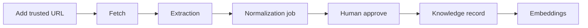

# Curation campaigns (Phase 2 Slice 6)

Organize **targeted research** into campaigns: define a topic, add trusted URLs only, track pipeline progress, and build a **human-reviewed** knowledge set.

## Principles

- **Campaigns organize work** — they do not bypass normalization review or auto-publish.
- **Trusted domains only** — same allowlist as Source Acquisition; no blind or recursive crawling.
- **Domain-aware** — every campaign is scoped to a `knowledge_domains` row.
- **Database-driven statuses** — no TypeScript enums.

## Pipeline



1. Create campaign (e.g. “Flux Kontext Mastery”).
2. **Add URL to campaign** — creates/links `sources` on trusted domains.
3. **Fetch all pending URLs** — runs existing `runSourceFetch` per source.
4. **Create normalization jobs** — draft outputs still `pending_review`.
5. Human approves on `/normalization/[id]`.
6. **Process embeddings** — syncs approved knowledge into `curation_campaign_outputs` and enqueues embeddings.

## Tables

| Table | Purpose |
|-------|---------|
| `curation_campaign_statuses` | draft, active, paused, completed, archived |
| `curation_campaign_source_statuses` | Per-URL pipeline status |
| `curation_campaigns` | Topic, objective, rules JSONB, domain |
| `curation_campaign_sources` | URLs + links to fetch/extraction/normalization jobs |
| `curation_campaign_outputs` | Approved knowledge, entities, related recipes/failures |

## UI

- `/curation` — campaign dashboard
- `/curation/new` — create campaign
- `/curation/[id]` — detail, metrics, batch actions
- `/curation/[id]/edit` — edit campaign

## Batch actions

| Action | Behavior |
|--------|----------|
| Fetch all pending URLs | `runSourceFetch` for pending/failed campaign sources |
| Create normalization jobs | Uses campaign `metadata.default_template_code` |
| Process embeddings | Syncs outputs + `enqueueEmbeddingJob` for approved knowledge |

## Tests

```bash
npm run test:curation-campaigns
```

## Out of scope

- Autonomous URL discovery or site crawling
- Agents, auto-approval, auto-publish
