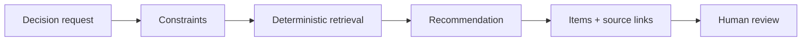

# Decision engine foundation (Phase 2 Slice 5)

Structured recommendations from **existing** CKOS knowledge — goals and constraints in, cited evidence out. No autonomous execution, workflow generation, or publishing.

## Principles

- **Retrieval-first** — full-text search over `knowledge_records`, `workflows` (+ `workflow_analysis`), `recipes`, and `failure_records`.
- **No hallucination** — every `decision_recommendation_items` row must reference a real CKOS entity (CHECK constraint).
- **Insufficient evidence** — when no records match, status `insufficient_evidence` and explicit `missing_information` warnings.
- **Database-driven taxonomy** — goal types and constraint types are lookup tables (no TypeScript enums).

## Flow



1. User opens **Decision Engine → New decision request**.
2. Enters goal text, goal type, optional constraints (hardware, platform, model family, etc.).
3. CKOS builds a retrieval query, searches approved content, and stores a **reviewable** recommendation.
4. User follows citation links to knowledge, workflows, recipes, and failure records.

## Tables

| Table | Purpose |
|-------|---------|
| `decision_statuses` | Request/recommendation lifecycle |
| `decision_goal_types` | Ten seeded goal types (maps to workflow purpose when applicable) |
| `decision_constraint_types` | Nine seeded constraint types |
| `decision_requests` | User goal + hardware/domain |
| `decision_request_constraints` | Typed constraint values |
| `decision_recommendations` | Approach, model family hint, confidence, missing info, warnings |
| `decision_recommendation_items` | Linked evidence (knowledge, workflow, analysis, failure, recipe) |
| `decision_source_links` | Citations for audit and UI |

## Recommendation output

- **Recommended approach** — narrative built only from retrieved top recipe/workflow
- **Suggested model family** — from constraints or matching model knowledge (if found)
- **Items** — knowledge required, recipes, workflows (with analysis), failure warnings
- **Confidence score** — deterministic function of hit counts and missing constraints
- **Missing information** — e.g. missing reference character constraint for consistency goals
- **Citations** — `decision_source_links` per item

## UI

- `/decision` — request list
- `/decision/new` — create request (auto-builds recommendation)
- `/decision/[id]` — recommendation detail + rebuild

## Tests

```bash
npm run test:decision-engine
```

## Out of scope

- Autonomous workflow execution or generation
- Agents, scraping, auto-publishing
- LLM-generated recommendations (retrieval-only in this slice)
