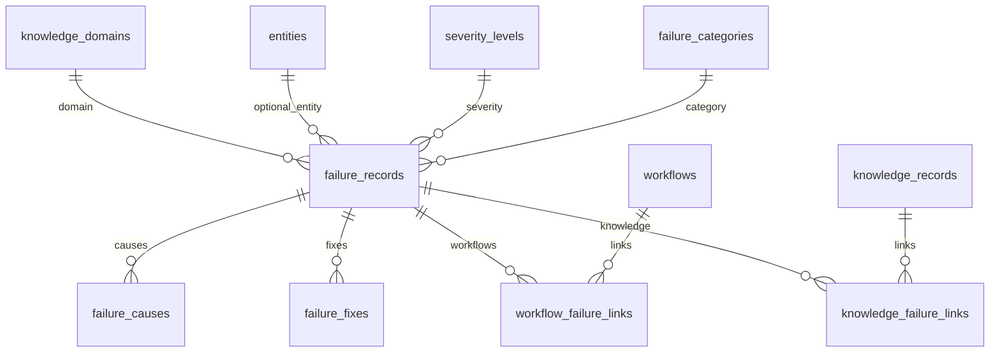

# CKOS Failure Intelligence

Failure intelligence stores **manually curated** generation failures as structured, domain-aware records. CKOS does not auto-generate failure claims in Phase 1.5 — no agents, no scraping, no AI inference.

---

## Data model



### `failure_records` (extended, legacy JSONB retained)

| Column | Purpose |
|--------|---------|
| `domain_id` | **Required** for new records — scopes failure to a knowledge domain |
| `entity_id` | Optional link to canonical `entities` (e.g. `flux_dev`, `openpose_controlnet`) |
| `severity_level_id` | FK → `severity_levels` |
| `category_id` | FK → `failure_categories` |
| `symptom` | Short title (e.g. "Face Drift") |
| `description` | Longer explanation |
| `probability_score` | 0–1 aggregate likelihood |
| `detection_signals` | JSONB tags for future automated detection |
| `analysis_metadata` | JSONB for extensions |
| `causes`, `fixes`, … | **Legacy JSONB** — kept; use relational tables for new data |

### `failure_causes`

Ranked hypotheses: `cause`, `confidence_score`, `evidence`, `sort_order`.

### `failure_fixes`

Ranked remedies: `recommended_fix`, `effectiveness_score`, `risk_level`, `notes`, `sort_order`.

### Link tables

| Table | Purpose |
|-------|---------|
| `workflow_failure_links` | Observed failure in a specific ComfyUI workflow (`likelihood_score`) |
| `knowledge_failure_links` | Tie failure to a knowledge record |

---

## Lookup tables (database-driven)

**Severity:** `low`, `medium`, `high`, `critical`

**Categories:** `anatomy`, `identity_consistency`, `controlnet`, `lora`, `model_loading`, `missing_nodes`, `vram`, `sampling`, `prompting`, `upscaling`, `video_motion`, `video_identity`, `workflow_validation`, `output_quality`, `unknown`

No TypeScript enums — UI loads rows from Supabase.

---

## User workflow (success criteria)

1. Open **Failure Explorer** → see seeded or custom failures.
2. **New failure** → set domain, symptom, severity, category, optional entity.
3. On detail page → add **causes** and **fixes** (ranked).
4. **Link workflow** (e.g. Flux + IPAdapter stack) with likelihood score.
5. **Link knowledge** records for cross-reference.
6. Retrieve **Face Drift** from explorer search/list and open detail with full context.

---

## API surface

Server actions in `src/actions/failures.ts`:

- `listFailures`, `getFailure`
- `createFailure`, `updateFailure`
- `createFailureCause`, `createFailureFix`, delete helpers
- `linkWorkflowFailure`, `linkKnowledgeFailure`, unlink helpers

---

## Validation

```bash
npm run test:failures
```

```sql
-- After migration
SELECT fr.symptom, sl.label AS severity, fc.label AS category,
  (SELECT COUNT(*) FROM failure_causes WHERE failure_id = fr.id) AS causes,
  (SELECT COUNT(*) FROM failure_fixes WHERE failure_id = fr.id) AS fixes
FROM failure_records fr
JOIN severity_levels sl ON sl.id = fr.severity_level_id
JOIN failure_categories fc ON fc.id = fr.category_id
WHERE fr.symptom = 'Face Drift';
```

---

## Future (not in Slice 3)

- Experience-based learning from run outcomes
- Automated detection using `detection_signals`
- Decision engine surfacing failures for goals/constraints
- Migration of legacy JSONB `causes`/`fixes` into relational rows
