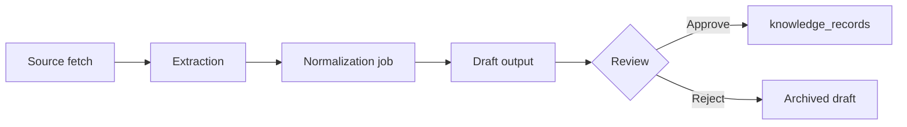

# Knowledge normalization queue (Phase 2 Slice 2)

Converts **reviewed** `source_extraction_results` into **draft** knowledge proposals. Nothing is published until a human **approves** the output.

## Flow



1. User fetches a trusted URL (Slice 1).
2. On source detail, **Create normalization job** (pick template + domain).
3. System creates `normalization_jobs` + `normalization_job_outputs` pre-filled from extraction title/summary and template defaults.
4. User edits draft (title, summary, structured JSON, entity alias).
5. **Save draft** resolves `proposed_entity_alias` via `resolve_entity_alias(domain, alias)` when possible.
6. **Approve & publish** inserts a new `knowledge_records` row (never overwrites existing) with:
   - `source_id`, `source_version_id`, `domain_id`, `entity_id`
   - `citations` preserved in `structured_data._normalization`
7. **Reject** records `normalization_review_decisions` without creating knowledge.

## Tables

| Table | Purpose |
|-------|---------|
| `normalization_statuses` | Job + output lifecycle (no TS enums) |
| `normalization_templates` | Six card types mapped to `knowledge_types` |
| `normalization_jobs` | One job per extraction + template request |
| `normalization_job_outputs` | Proposed knowledge (draft / pending_review / approved / rejected) |
| `normalization_review_decisions` | Immutable approve/reject audit |

## Templates (seed)

| Code | Label | Knowledge type |
|------|-------|----------------|
| `concept_card` | Concept Card | technique |
| `model_card` | Model Card | model |
| `node_card` | Node Card | node |
| `workflow_pattern_card` | Workflow Pattern Card | workflow |
| `failure_candidate_card` | Failure Candidate Card | failure |
| `recipe_candidate_card` | Recipe Candidate Card | technique |

## UI

- `/normalization` — queue dashboard
- `/normalization/[id]` — job detail + draft editor + approve/reject
- `/sources/[id]` — create job from latest extraction

## Audit events

- `normalization_job_create`
- `normalization_approve` / `normalization_reject`
- `create` on `knowledge_record` when approved

## Tests

```bash
npm run test:normalization
```

## Out of scope

- Autonomous or AI publishing (optional AI may be added later as draft-only)
- Overwriting existing knowledge records
- Agents, crawling, auto-normalization
