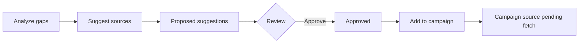

# Source discovery suggestions (Phase 2 Slice 8)

Turns **knowledge gaps** into reviewable **trusted URL / search targets** without blind crawling or auto-fetch.

## Principles

- **Gap-driven** — every suggestion links to a `knowledge_gap` and/or `curation_campaign`.
- **Trusted domains only** — same allowlist as Source Acquisition.
- **Human gate** — approve → optionally **Add to campaign** (creates campaign source row, does not fetch).
- **No external web search API** in this slice — deterministic suggestions from extractions, existing sources, and constructed trusted-domain search URLs.

## Flow



## Suggestion logic (by gap type)

| Gap type | Suggestion strategy |
|----------|---------------------|
| `missing_workflow` | Extraction links + wiki/docs search targets |
| `missing_failure_modes` | Failure-related links + search targets |
| `missing_recipe` | Related links + existing recipes + search |
| `stale_source` | Refetch review for existing campaign source URL |
| `missing_citations` | Search targets for corroboration (manual review) |
| `weak_confidence` | Alternate trusted sources + search targets |

## Tables

| Table | Purpose |
|-------|---------|
| `discovery_statuses` | proposed → approved → added_to_campaign / rejected / dismissed |
| `discovery_suggestion_sources` | manual, search_query, known_trusted_domain, etc. |
| `source_discovery_suggestions` | URL, reason, confidence, trusted domain |
| `gap_discovery_links` | Gap ↔ suggestion |

## UI

- `/discovery` — global suggestion queue
- `/gaps/[id]` — Suggest sources + per-gap list
- `/curation/[id]` — Suggest sources for gaps + campaign suggestions panel

## Tests

```bash
npm run test:source-discovery
```

## Out of scope

- Autonomous crawling, recursive fetch, auto-publish
- Unapproved URLs added to campaigns automatically
